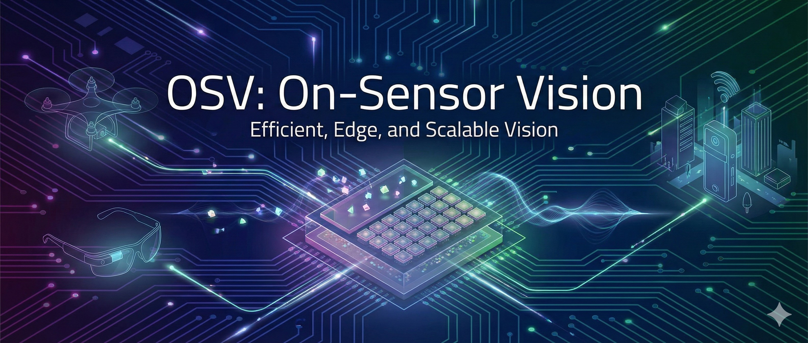

---
# Feel free to add content and custom Front Matter to this file.
# To modify the layout, see https://jekyllrb.com/docs/themes/#overriding-theme-defaults

permalink: /
title: 
layout: home
---

Computer Vision is moving to the edge - into drones, robots, IoT devices, AR/VR headsets and autonomous systems. These applications demand processing that is fast, energy-efficient, and privacy-preserving. On-sensor vision adresses these challenges by unifying sensing and computation on a single chip, producing information-rich outputs instead of raw pixel data.

In modern computing systems, data movement costs more than computation. By integrating procesing at the sensor By integrating processing directly at the sensor - whether through Pixel Processor Arrays (PPAs) like Manchester's SCAMP, stacked 3D sensors or analog processing - we can eliminate expensive data transfers and enable real-time operation at sub-watt power levels.

This workshop brings together researchers working on algorithms, architectures, and systems for on-sensor and near-sensor vision. We'll explore what computation should happen on-sensor versus off-sensor, what representations sensors should output when they produce information rather than images, and how to co-design algorithms and hardware for next-generation vision systems.

## Workshop Scope 
In Scope 
- Algorithms for on or near sensor computer vision
- Pixel-parallel processor arrays (digital and analog)
- Graph algorithms for fine-grained parallelism 
- In-sensor and near-sensor neural networks
- Cellular automata and bio-inspired vision
- Algorithm-hardware co-design for sensor-integrated processing
- Partitioning strategies between on-sensor and off-sensor computation
- Novel architectures: stacked sensors, analog processing, neuromorphic systems
- Programming models and simulators for processing arrays

## Key Workshop Questions 
- which vision tasks belong on-sensor ?
- what intermediate representations should sensors emit ? 
- What are the benefits, applications and key tradeoffs of near sensor processing ?
- how much programmability is needed in pixel parallel arrays ?